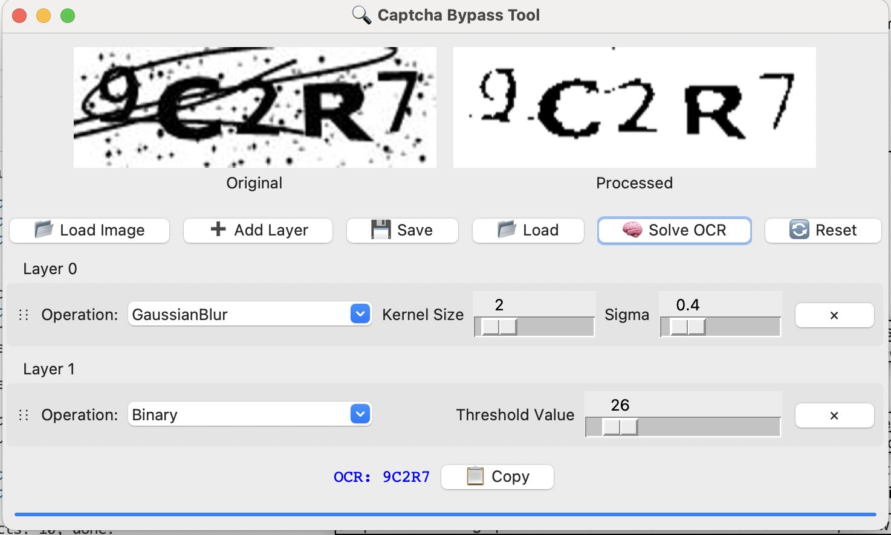

# 🔍 Captcha Bypass Tool

A powerful GUI application for automated captcha solving using advanced image processing techniques and OCR.

## 📸 Screenshot



## 🚀 Features

- Advanced image processing with multiple layers
- Real-time preview of processing results
- Drag-and-drop layer management
- Customizable processing parameters
- Tesseract OCR integration
- Settings management and presets
- Support for various captcha types

## 📋 Requirements

- Python 3.8+
- OpenCV (cv2)
- NumPy
- Pillow (PIL)
- Tesseract OCR
- tkinter

## 🛠️ Installation

1. Install required Python packages:
```bash
pip install -r requirements.txt
```

2. Install Tesseract OCR:
- macOS:
```bash
brew install tesseract
```
- Linux:
```bash
sudo apt-get install tesseract-ocr
```
- Windows:
[Tesseract OCR Download Page](https://github.com/UB-Mannheim/tesseract/wiki)

## 🎮 Usage

1. Start the application:
```bash
python captcha_bypass.py
```

2. Load Captcha Image:
   - Click the "📂 Load Image" button to select a captcha image
   - Supported formats: JPG, JPEG, PNG

3. Process the Image:
   - Add processing layers using "➕ Add Layer"
   - Configure each layer's parameters
   - Reorder layers using drag-and-drop
   - Remove layers using the "×" button

4. Available Processing Types:
   - Binary: Basic thresholding
   - Adaptive: Adaptive thresholding
   - Otsu: Automatic thresholding
   - GaussianBlur: Noise reduction
   - RemoveSmallNoise: Clean small artifacts
   - RemoveThinLines: Remove thin lines
   - SmoothEdges: Edge smoothing
   - Morphology: Shape manipulation

5. Settings Management:
   - Save successful configurations as presets
   - Load previously saved presets
   - Quick access to last used settings
   - Default settings for common captcha types

6. OCR Process:
   - Click "🧠 Solve OCR" to recognize text
   - View results instantly
   - Copy text to clipboard with "📋 Copy"

## 💾 Saving Presets

1. Save Current Settings:
   - Go to Settings menu
   - Select "Save Current Settings"
   - Name your preset
   - Settings are saved in the `presets` folder

2. Load Presets:
   - Open Settings menu
   - Choose "Load Settings"
   - Select your desired preset

## 🔧 Development

To contribute to the project:

1. Clone the repository:
```bash
git clone https://github.com/r1z4x/captcha-bypass-tool.git
```

2. Install development dependencies:
```bash
pip install -r requirements.txt
```

3. Test your changes and submit a pull request

## 📝 License

This project is licensed under the MIT License. See the [LICENSE](LICENSE) file for details.

## 🤝 Contributing

1. Fork it
2. Create your feature branch (`git checkout -b feature/amazing-feature`)
3. Commit your changes (`git commit -m 'Add some amazing feature'`)
4. Push to the branch (`git push origin feature/amazing-feature`)
5. Open a Pull Request

## 📞 Contact

Project Owner - [@r1z4x](https://github.com/r1z4x)

Project Link: [https://github.com/r1z4x/captcha-bypass-tool](https://github.com/r1z4x/captcha-bypass-tool)
